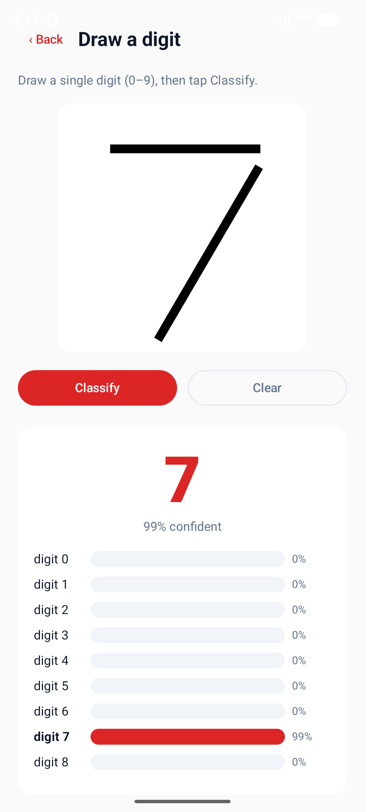
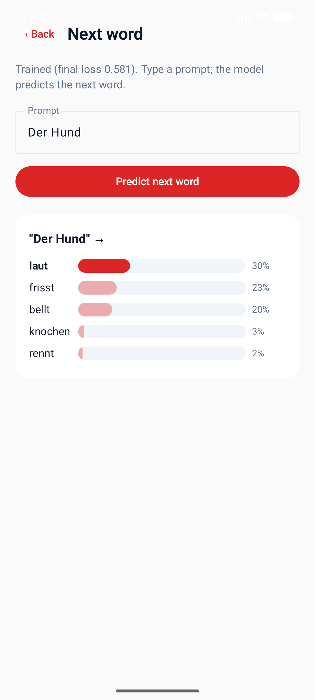
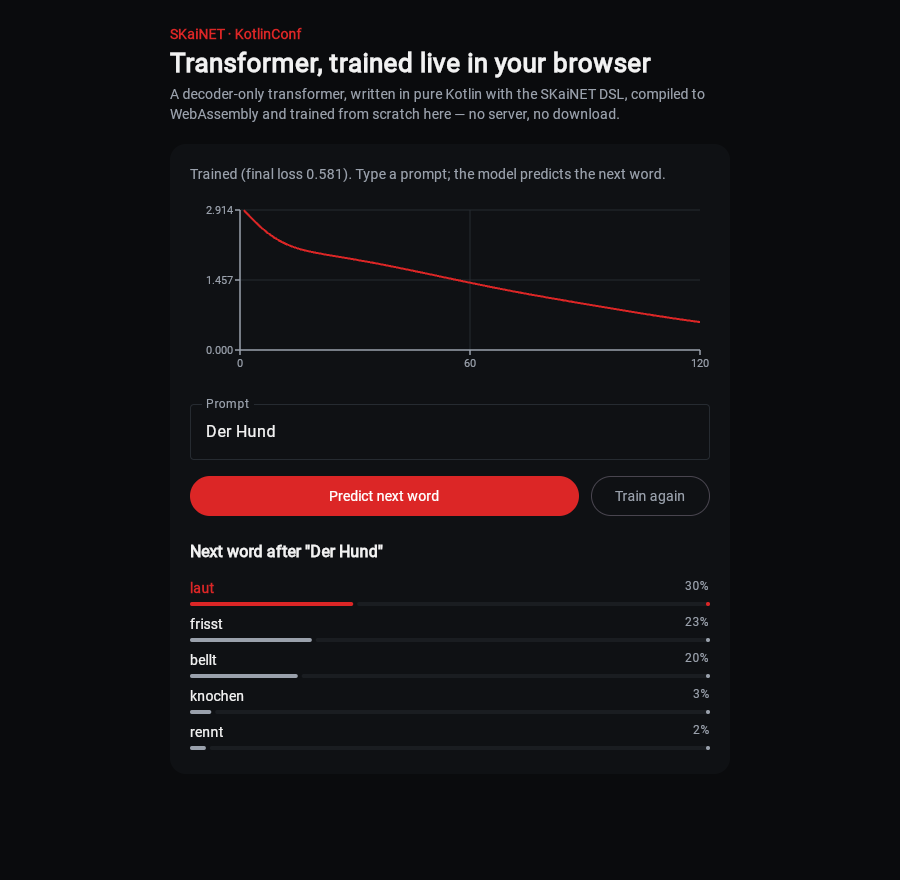

# Redefining Machine Learning with Kotlin: A Device-First Approach to AI

This repository contains the materials for my [KotlinConf](https://kotlinconf.com/) talk.

**Speaker:** [Michal Harakal](https://kotlinconf.com/speakers/bf79ffe5-f576-43e2-8d4b-3a43161c1a50/)
**Session:** May 22, 11:15 – 12:00 (introductory and overview session)

## About the talk

Large Language Models have revolutionized AI — but their centralized nature comes with real costs: concentration of knowledge, privacy risks, and latency. What if Kotlin developers could flip the script, bringing powerful AI directly onto devices with an open-source, developer-friendly machine learning framework? In this talk, we’ll take you inside our journey of building SKaiNET, a brand-new framework written from scratch in Kotlin Multiplatform. We’ll start by exploring the limitations of today’s tools, then walk step-by-step through defining neural networks in Kotlin using a type-safe DSL, compiling them into compute graphs, and running lightweight models like convolutional nets and compact LLMs completely offline — all in pure Kotlin. You’ll learn how Kotlin’s strengths — coroutines, type safety, and multiplatform support — enable low-latency, privacy-first AI that runs directly on-device. With features like flexible tensor layouts and support for multiple file formats, SKaiNET bridges the gap between mobile development and data science. It’s open-source. It’s powerful. And you’re invited to help shape its future. Expect code, insights, and a hands-on look at how Kotlin (and SKaiNET) is quietly redefining mobile AI.

## Talk materials

### Slides

[`slides/`](slides/) — talk slides ([PDF](slides/2026-KotlinKonf-MHarakal-SKaiNET.pdf))

### Source code

[`code/`](code) — a runnable Kotlin Multiplatform (JVM + Android + WebAssembly) project that
follows the talk as **five patterns**, each using the real
[SKaiNET](https://github.com/SKaiNET-developers/SKaiNET) DSL (pinned to **0.36.0** / Kotlin
2.4.0):

1. **Tensors** — scalar → vector → matrix → tensor → batch, and NumPy-style slicing
2. **Linear** — `dense` layers and `forward(x, ctx)` (forward propagation)
3. **MLP** — a network approximating `y = sin(x)` (pretrained weights)
4. **CNN** — a LeNet-style MNIST classifier with pretrained weights, the device-first model
5. **Transformer** — a decoder-only transformer **trained live** in a couple of seconds

Each model is a **standalone, publishable Gradle module** with an async (Flow +
structured-concurrency) loading API and a Java-compatible facade. The CNN bundles its one
`mnist_cnn.gguf` weight file, served across every platform from a single copy via kotlinx-io.

The Android app turns the CNN and transformer into two **interactive, on-device** demos — draw a
digit and watch the CNN recognise it, or train the transformer live and ask it for the next word.
The web app runs the **same transformer** in the browser: a SKaiNET rotating-logo splash, a
**Start training** button, and a live loss curve while it trains from scratch on WebAssembly:

| Draw a digit (CNN, Android) | Next word (Transformer, Android) | Transformer in the browser (Wasm) |
| --- | --- | --- |
|  |  |  |

Start with the [**slide → code map**](docs/slide-to-code.md), which lines each pattern up with the
deck. Then:

```bash
cd code
./gradlew :cli:runCnn                       # classify real MNIST digits with the pretrained CNN
./gradlew :cli:runTransformer               # train a tiny transformer, then predict the next word
./gradlew check                             # run the tests for every pattern
./gradlew :androidApp:assembleDebug         # build the interactive on-device Android app
./gradlew :webApp:wasmJsBrowserDevelopmentRun   # run the transformer live in the browser
```

The same `sk.ainet.kotlinconf.*` model code runs on the JVM, Android, and the browser — the
talk's device-first, one-codebase thesis. See [`code/README.md`](code/README.md) for details.

> Pinned to SKaiNET **0.36.0** / Kotlin 2.4.0; for newer versions see the official
> [SKaiNET examples repository](https://github.com/SKaiNET-developers/SKaiNET-examples).

You can also explore the [live in-browser SKaiNET demos](https://examples.skainet.sk/) and the
[SKaiNET project](https://github.com/SKaiNET-developers/SKaiNET) itself.

## License

See [LICENSE](LICENSE).
